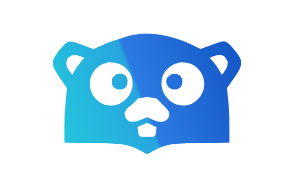

<!-- togo-header -->
<div align="center">
  
  <h1>togo-framework/log-sentry</h1>
  <p>
    <a href="https://to-go.dev/marketplace"></a>
    <a href="https://pkg.go.dev/github.com/togo-framework/log-sentry"></a>
    
  </p>
  <p><strong>Part of the <a href="https://to-go.dev">togo</a> framework.</strong></p>
</div>

## Install

```bash
togo install togo-framework/log-sentry
```

<!-- /togo-header -->

<!-- togo-brand -->
<p align="center">
  
</p>
<h1 align="center">log-sentry</h1>
<p align="center"><sub>part of the <a href="https://github.com/togo-framework">togo-framework</a> — the full-stack Go + React framework</sub></p>

**Sentry** error tracking for togo. Captures every kernel `error` event (fired by
`togo.ReportError` when a request or background job fails) to [Sentry](https://sentry.io)
with stack traces, environment and release tagging.

```bash
togo install togo-framework/log-sentry
```

Install alongside `togo-framework/log`. Blank-importing the plugin registers it.

## Env

| Var | Required | Description |
|---|---|---|
| `SENTRY_DSN` | yes | Your Sentry DSN. When unset the plugin is a no-op. |
| `SENTRY_ENVIRONMENT` | no | e.g. `production`, `staging`. |
| `SENTRY_RELEASE` | no | Release identifier for tagging. |

## How it works

On boot (after the `log` plugin) it initialises the Sentry SDK and subscribes to
the kernel `error` hook. Errors are sent asynchronously; buffered events are
flushed on the `shutdown` hook.

MIT © togo-framework

<!-- togo-sponsors -->
---

<div align="center">
  <h3>Premium sponsors</h3>
  <p>
    <a href="https://id8media.com"><strong>ID8 Media</strong></a> &nbsp;·&nbsp;
    <a href="https://one-studio.co"><strong>One Studio</strong></a>
  </p>
  <p><sub>Support togo — <a href="https://github.com/sponsors/fadymondy">become a sponsor</a>.</sub></p>
</div>
<!-- /togo-sponsors -->
